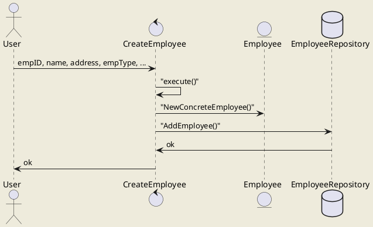

# Create Employee Use Case

> A new employee is added by the receipt of an `AddEmp` transaction. This transaction contains the employee's name, address, and assigned employee number. The transaction has the following three forms:
>
> ```xml
> AddEmp <EmpID> "<name>" "<address>" H <hourly-rate>
> AddEmp <EmpID> "<name>" "<address>" S <monthly-salary>
> AddEmp <EmpID> "<name>" "<address>" C <monthly-salary> > <commission-rate>
> ```
>
> The employee record is created with its fields assigned appropriately.
>
> - **Alternative:**
>
>   **An error in the transaction structure**
>
>   If the transaction structure is innapropriate, it is printed out in an error message, and no action is taken.

## Strategy

As all forms of this use case follow the same basic steps, a template method pattern is used to orchestrate the execution and concrete implementatios of each case deal with the specifics.

## Sequence Diagram


